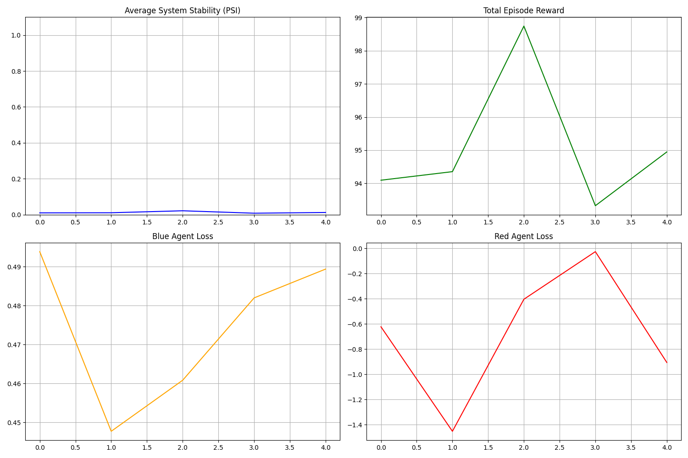

# L2M-AID V2: LLM-Driven Adversarial Self-Play for Generic CPS Defense



This repository contains the official implementation of **L2M-AID V2**, an autonomous defense framework for Cyber-Physical Systems (CPS). It fuses **Hierarchical Multi-Agent Reinforcement Learning (MARL)** with **Large Language Models (LLMs)** to create adaptive, explainable, and robust defense strategies against evolving adversarial threats.

## 🌟 Key Research Capabilities

### 1. Generic CPS Environment (`GenericCPSEnv`)
Unlike static testbeds (e.g., SWaT), this framework uses a mathematically generalized **Linear Time-Invariant (LTI)** physics engine.
-   **Nodes & Actuators**: Configurable N-node topology.
-   **Dynamics**: $dx/dt = -Ax + Bu + Noise$.
-   **Generalizability**: Can simulate Power Grids, Water Plants, or IoT Networks by adjusting coupling matrices.

### 2. Adversarial Self-Play (Red vs. Blue)
-   **Red Team (Attacker)**: Uses **Entropy-Regularized REINFORCE** to learn optimal attack sequences (DoS, Integrity Spoofing, Actuator MitM).
-   **Blue Team (Defender)**: Uses **MAPPO (Multi-Agent PPO)** constrained by semantic safety guidance.
-   **Dynamics**: Zero-sum game structure driving continuous adaptation (Arms Race).

### 3. Generative Explainability
-   **Semantic Root Cause Analysis**: An LLM-based agent monitors the episode trace and generates human-readable reports explaining *unstable states* and *agent decisions*.
-   **Safety Scoring**: Real-time semantic evaluation of system logs to shape RL rewards ($R = PSI + 0.5 \cdot S_{LLM}$).

## 📂 Project Structure

*   `src/envs`:
    *   `generic_cps.py`: The LTI Physics Engine.
    *   `network_sim.py`: Packet-level network simulation (Latencies, Drops).
*   `src/agents`:
    *   `blue/orchestrator.py`: Strategic LLM Agent (Brain).
    *   `blue/tactical.py`: Low-level MAPPO Control Agents (Body).
    *   `red/learning.py`: Adversarial Learning Agent.
*   `src/modules`:
    *   `explanation.py`: Generative Post-Hoc Explainer.
    *   `llm_client.py`: Hardware-optimized Inference Engine (4-bit/float16).

## 🚀 Quick Start (Google Colab)

The easiest way to replicate our experiments is using the provided Notebook on a T4 GPU.

1.  **Upload** code to Google Drive.
2.  **Open** `LLM_Driven_Self_Play.ipynb`.
3.  **Run All Cells**.

## 💻 Local Installation

```bash
# 1. Install Dependencies
pip install -r requirements.txt

# 2. Run Training (Mock LLM - Fast CPU)
python scripts/train_selfplay.py --mode adversarial --episodes 100 --provider mock

# 3. Run Training (Phi-3 LLM - GPU Required)
python scripts/train_selfplay.py --mode adversarial --episodes 500 --provider huggingface --model microsoft/Phi-3-mini-4k-instruct
```

## 📊 Outputs

*   **Plots**: `results/training_results.png` (Updated live).
*   **Explanations**: `results/explanations.txt` (Generated every 50 episodes).
*   **Checkpoints**: `checkpoints/` (Saved weights).

## 📜 Citation

If you use this code, please cite the original paper:
> *L2M-AID: Autonomous Cyber-Physical Defense by Fusing Semantic Reasoning of Large Language Models with Multi-Agent Reinforcement Learning.*
